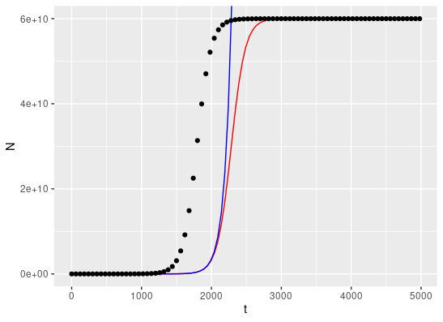

Question 1:
During the analysis, I produced a logistic model to model the growth of the bacterial population in experiment1 (experiment1.csv). In this experiment the populations of Escherichia coli were measured at intervals, from the initial population at time 0 for 5000 minutes. As part of the analysis linear models were calculated for each end of the growth curve. The y intercepts of the models corresponded to the initial population (N0) and carrying capacity (K), respectively. The rate of growth was also estimated as the gradient of model1, representing the first 1250 minutes. The code for these linear models can be found in the fit_linear_model.R file.

The experiment had the following estimated characteristics:
N0 <- 6.888e+00 # the starting number of bacteria,
r <- 1.002e-02 # the rate of growth,
K <- 6.00e+10 # the carrying capacity

A logistic growth model was then produced and mapped onto the same plots as seen in the plot_data_and_model.R file. The model was produced using the same parameters and thus showed similar characteristics to the real data. However, it develop more slowly with curve taking longer to reach the maximum growth rate. This perhaps suggests inaccuracies in the linear models used to estimate the N0, K. The actual starting population was definitely much larger as 6.888 seems very low; explaining this discrepancy.   

Question 2:
The population sizes at t = 4980 for the logistic model and exponential model were 6e+10 and 3.23e+22, respectively. As expected, the population in the exponential model is much greater since in the logistic model the population reaches the carrying capacity. 
The code for this calculation can be found at the bottom of the plot_data_and_model.R file. 

Question 3: A plot of the bacterial population with a logistic model in red and an exponential model in blue. Time (t), in minutes, on the x axis, and number of bacteria on the y axis.

